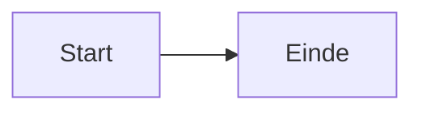

# Clidev - CEDA Slidev Presentaties

Skill voor het maken van Slidev presentaties in de CEDA/Npuls huisstijl. Bouwt voort op `/slidev` voor algemene Slidev-kennis — de regels hier hebben voorrang.

## Projectsetup (altijd als eerste stap)

Voer deze stappen uit in volgorde voordat je een presentatie aanmaakt.

### 1. Controleer of de slidev skill aanwezig is

```bash
ls ~/.claude/skills/slidev/ 2>/dev/null && echo "aanwezig" || echo "niet aanwezig"
```

Als de slidev skill niet aanwezig is, installeer hem eerst:

```bash
npx skills add slidevjs/slidev
```

### 2. Zoek het project op de machine

Zoek naar een directory die de kenmerken heeft van het clidev project — aanwezigheid van `_template.md`, een `style.css` en een `public/npuls/` structuur:

```bash
find ~ -type f -name "_template.md" 2>/dev/null | xargs -I{} dirname {} | while read dir; do
  [ -f "$dir/style.css" ] && [ -d "$dir/public/npuls" ] && echo "$dir"
done | head -3
```

- Als een directory gevonden wordt: gebruik die locatie, ongeacht de naam van de map
- Als niets gevonden wordt: vraag de gebruiker waar het project gekloond mag worden, en gebruik die locatie

```bash
git clone https://github.com/cedanl/clidev-presentaties.git <door-gebruiker-opgegeven-pad>
```

Na navigeren altijd `npm install` draaien als `node_modules/` ontbreekt.

## Quickstart

```bash
cp _template.md YYMMDD_onderwerp.md
npx slidev YYMMDD_onderwerp.md --open
```

Naamconventie: `YYMMDD_onderwerp.md` — bijv. `260311_leeranalytics.md`

## Projectstructuur

```
clidev-presentaties/
├── YYMMDD_onderwerp.md
├── _template.md
├── style.css                        # Globaal designsysteem (np-* classes)
└── public/
    ├── npuls/
    │   ├── powerpoint_slides/        # Achtergronden (Slide1-19.PNG)
    │   ├── powerpoint_illustrations/ # SVG-iconen
    │   ├── npuls_logo.jpg
    │   └── Npuls_lettertype/
    ├── shots/                        # Screenshots voor in de slides
    ├── ceda_contributors/
    └── presentations/YYMMDD_onderwerp/
```

## Thema en designsysteem

Elke presentatie gebruikt `theme: default` in de frontmatter. De huisstijl komt uit `style.css` in de projectroot: Slidev laadt dat bestand automatisch voor elke presentatie. Geen `<style>` blok in presentatiebestanden, geen `theme:`-map.

`style.css` definieert de Npuls-fonts, kleurtokens, een opgeschoonde achtergrondlaag en een complete componentbibliotheek met `np-`-classes (kaarten, grids, badges, pipelines, enz.). Bouw slides altijd met die classes, zodat presentaties er consistent uitzien. Pas de huisstijl alleen in `style.css` aan, nooit per presentatie.

> Verouderd: oudere presentaties gebruiken `theme: ./theme` met ``-achtergronden en `--npuls-*` variabelen. Dat is vervangen door `theme: default` + `style.css`. Volg voor nieuwe presentaties altijd het nieuwe systeem.

## Npuls Huisstijl

### Kleuren

Gebruik de CSS-tokens uit `style.css`, niet de losse hex-waarden.

| Gebruik | Token | Hex |
|---------|-------|-----|
| H1, H2 | `var(--np-orange)` | `#DD784B` |
| H3 (kop in kaart) | `var(--np-dark-blue)` | `#1B2A6B` |
| Bold, links | `var(--np-blue)` | `#3D68EC` |
| Body / titeltekst | `var(--np-ink)`, `var(--np-dark-gray)` | `#1A1A2E`, `#374151` |
| Gedempte tekst | `var(--np-mid-gray)` | `#6B7280` |
| Accenten | `var(--np-green)`, `var(--np-yellow)`, `var(--np-pink)` | `#00AF81`, `#F4D74B`, `#F4D9DC` |

**Mermaid-diagrammen:**
- Primaire nodes: `fill:#3D68EC,stroke:#DD784B,color:#fff`
- Belangrijke nodes: `fill:#DD784B,stroke:#3D68EC,color:#fff`
- Succes-nodes: `fill:#00AF81,color:#fff`

### Lettertypen

| Lettertype | Gewicht | Gebruik |
|------------|---------|---------|
| General Sans Regular | 400 | Bodytekst |
| General Sans Semi-Bold | 600 | H1, H2, H3 |
| Cooper Light BT | 300 | Citaten |

## Achtergronden

Gebruik altijd de `.np-bg` class met `background-image`. Die laag staat al op `z-index: -1` en de overlays uit de default-theme zijn weggehaald, zodat de plaat scherp doorkomt. Nooit `background:` in de frontmatter zetten.

```html
<div class="np-bg" style="background-image: url(/npuls/powerpoint_slides/Slide3.PNG);"></div>
```

| Bestand | Gebruik | Bijzonderheden |
|---------|---------|----------------|
| `Slide1.PNG` | Titelslide | |
| `Slide2.PNG` | Agenda / Over ons | Tekst RECHTS (afbeelding links) |
| `Slide3.PNG` | Standaard contentslide | |
| `Slide4.PNG`–`Slide12.PNG` | Varianten content | Vrij te gebruiken |
| `Slide13.PNG` / `Slide14.PNG` / `Slide15.PNG` | Hoofdstukdividers | Witte tekst verplicht |
| `Slide17.PNG` | Afsluitslide | Geen tekst |

## Content centreren

**Content slides** — wikkel de inhoud in `.fill`. Die class vult de hele slide en centreert verticaal (`position: absolute; inset: 0; flex; justify-content: center; padding: 2.2rem 3rem`):

```html
<div class="np-bg" style="background-image: url(/npuls/powerpoint_slides/Slide3.PNG);"></div>

<div class="fill">

# Slidetitel

<p class="np-subtitle">Een ondertitel die de slide samenvat.</p>

content hier

</div>
```

**Titel-, divider- en agenda-slides** wijken af van `.fill`; gebruik de patronen uit `_template.md` (gecentreerde flex-wrapper voor de titel, `flex items-center justify-center h-full` voor dividers, `margin-left: 42%` voor de agenda rechts).

**Hoofdstukdivider** (Slide13/14/15) — witte tekst, met eyebrow:

```html
<div class="np-bg" style="background-image: url(/npuls/powerpoint_slides/Slide14.PNG);"></div>

<div class="flex items-center justify-center h-full">
  <div style="text-align: center;">
    <p class="eyebrow" style="color: rgba(255,255,255,0.85);">Deel 1</p>
    <h1 style="color: #FFFFFF !important; font-size: 3rem;">Hoofdstuktitel</h1>
  </div>
</div>
```

## Componentbibliotheek

`style.css` levert de bouwstenen waarmee elke slide is opgebouwd. Combineer ze; verzin geen losse inline-stijlen waar een class bestaat.

**Tekst-helpers**
- `.eyebrow` — klein oranje kapitaaltjeslabel boven een titel
- `.np-subtitle` — ondertitel direct onder de `#` titel
- `.muted` — gedempte (grijze) tekst

**Kaarten** — `.np-card` met een accentrand bovenaan:
```html
<div class="np-card accent-blue">
  <span class="np-badge blue">Label</span>
  <h3 style="margin-top: 0.5rem;">Kop</h3>
  <p class="muted" style="font-size: 0.84rem; margin: 0;">Tekst.</p>
</div>
```
Accenten: `accent-blue`, `accent-orange`, `accent-green`, `accent-yellow`, `accent-pink`.

**Grids** — `.np-grid-2`, `.np-grid-3`, `.np-grid-4` voor kolommen met gelijke breedte (zet vaak `align-items: start`).

**Badges** — `.np-badge` met kleur `blue` / `orange` / `green` / `yellow` / `pink` / `ghost` (ghost = wit op een donkere achtergrond).

**Pipeline / proces** — `.np-pipeline` met `.np-step` (kleur `blue`/`orange`/`green`) en `.np-arrow` ertussen. In een step: `<strong>` als titel, `<small>` als toelichting.

**Bewijsstrip** — `.np-proof-strip` met `.np-proof-item` (icoon `.np-proof-check`) en `.np-proof-divider` ertussen, voor een rij korte keurmerken.

**Bottomline** — `.np-bottomline`, een blauw-oranje verloopbalk met de kernboodschap; `<strong>` daarin wordt geel.

**Genummerde chips** — `.np-num` (ronde gekleurde cijferchip) voor agenda's en stappenlijsten; geef volgende chips een andere `background` via inline-stijl.

**Screenshotframe** — `.np-frame` of een `` met `border-radius: 8px` en een zachte `box-shadow`, voor screenshots uit `public/shots/`.

## Illustraties

Controleer exacte bestandsnaam — hoofdlettergevoelig:

```bash
ls public/npuls/powerpoint_illustrations/ | grep -i "zoekwoord"
```

```html

```

## Technische vereisten

Dit zijn de dingen die echt stuk gaan als je ze negeert:

- **Theme**: `theme: default` in de frontmatter, niet `theme: ./theme`. De huisstijl komt uit `style.css`, dat Slidev automatisch laadt
- **Achtergronden**: altijd `<div class="np-bg" style="background-image: ...">`, nooit `background:` in de frontmatter
- **Content**: wikkel in `.fill` (of een van de titel/divider-patronen), zodat alles netjes verticaal gecentreerd staat
- **Hoofdstukslides** (Slide13/14/15): altijd witte tekst (`color: #FFFFFF`)
- **Afsluitslide** (Slide17): geen tekst, alleen achtergrond
- **Agenda slide** (Slide2): content rechts plaatsen, niet links
- **Code highlighting**: `{1|2-3|all}` syntax niet in een `v-click` wrapper — dat breekt de klik-progressie
- **Overflow**: als een slide overloopt, splits je hem op of verklein je de font-size; testen in de browser is de enige manier om dit te zien

### Mermaid

```markdown

```

Houd scale laag (0.5–0.6) en labels kort om overflow te voorkomen.

## Slide layouts in de template

`_template.md` bevat werkende voorbeelden in het nieuwe designsysteem:

- Titelslide (gecentreerd)
- Agenda (genummerde chips, tekst rechts)
- Hoofdstukdivider (eyebrow + witte tekst)
- Content met bullets + accentkaart
- Drie kaarten met badges + bottomline
- Pipeline / proces met bewijsstrip
- Twee kolommen met kaarten
- Citaat / highlight
- Code demo
- Screenshot (uit `public/shots/`)
- Tabel
- Illustratie + tekst
- Afsluitslide

Voeg zo veel of zo weinig slides toe als de presentatie vraagt. De template is een startpunt, geen blauwdruk.

## CLI

```bash
npx slidev YYMMDD_onderwerp.md --open     # Dev server (localhost:3030)
npx slidev export YYMMDD_onderwerp.md    # PDF
npx slidev export YYMMDD_onderwerp.md --format pptx
```

Druk op `P` in de browser voor presentatormodus.

## Afsluiting na aanmaken presentatie

Na het aanmaken van een presentatie sluit je altijd af met een korte instructie aan de gebruiker. Vermeld de exacte bestandsnaam en het pad zodat de gebruiker direct aan de slag kan:

```
Om de presentatie te bekijken, run vanuit <projectpad>:

    npx slidev <bestandsnaam>.md --open

De presentatie opent op http://localhost:3030
```

## Installatie

De skill staat in de centrale skills-repo van de organisatie (`cedanl/.github`):

```bash
npx skills add cedanl/.github
```

Vereist ook de slidev skill voor basiskennis:

```bash
npx skills add slidevjs/slidev
```

De presentaties en het designsysteem (`style.css`, `_template.md`, achtergronden) staan in `cedanl/clidev-presentaties`; die repo wordt tijdens de projectsetup gekloond.
