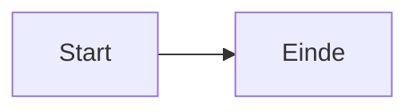

# Clidev - CEDA Slidev Presentaties

Skill voor het maken van Slidev presentaties in de CEDA/Npuls huisstijl. Bouwt voort op `/slidev` voor algemene Slidev-kennis en op `/vormgever-npuls-huisstijl` voor alle brand- en huisstijlbeslissingen. De regels hier hebben voorrang op beide.

**Verantwoordelijkheidsverdeling:**

- `clidev` (deze skill) — structuur: slide-patronen, positionering, grid-logica, componentassemblage, workflow
- `vormgever-npuls-huisstijl` — brand: kleurtokens, typografische schaal, toegestane kleurencombinaties
- `style.css` in de repo — integratiepunt: vertaalt brand-tokens naar CSS-variabelen die slides gebruiken

Wijzigingen in `vormgever-npuls-huisstijl` vereisen maximaal een update van `style.css`. Geen enkele slide-file en geen regel in deze skill mag daarvoor aangepast worden.

## Projectsetup (altijd als eerste stap)

Voer deze stappen uit in volgorde voordat je een presentatie aanmaakt.

### 1. Controleer of de slidev skill aanwezig is

```bash
ls ~/.claude/skills/slidev/ 2>/dev/null && echo "aanwezig" || echo "niet aanwezig"
```

Als de slidev skill niet aanwezig is, installeer hem eerst:

```bash
npx skills add slidevjs/slidev
```

### 2. Zoek het project op de machine

Zoek naar een directory die de kenmerken heeft van het clidev project:

```bash
find ~ -type f -name "_template.md" 2>/dev/null | xargs -I{} dirname {} | while read dir; do
  [ -f "$dir/style.css" ] && [ -d "$dir/public/npuls" ] && echo "$dir"
done | head -3
```

- Als een directory gevonden wordt: gebruik die locatie, ongeacht de naam van de map
- Als niets gevonden wordt: vraag de gebruiker waar het project gekloond mag worden

```bash
git clone https://github.com/cedanl/clidev-presentaties.git <door-gebruiker-opgegeven-pad>
```

Na navigeren altijd `npm install` draaien als `node_modules/` ontbreekt.

## Quickstart

```bash
cp _template.md YYMMDD_onderwerp.md
npx slidev YYMMDD_onderwerp.md --open
```

Naamconventie: `YYMMDD_onderwerp.md` — bijv. `260311_leeranalytics.md`

## Projectstructuur

```
clidev-presentaties/
├── YYMMDD_onderwerp.md
├── _template.md
├── style.css                        # Integratiepunt: CSS-variabelen op basis van brand-tokens
└── public/
    ├── npuls/
    │   ├── powerpoint_slides/        # Achtergronden (Slide1-19.PNG)
    │   ├── powerpoint_illustrations/ # SVG-iconen
    │   ├── npuls_logo.jpg
    │   └── Npuls_lettertype/
    ├── shots/                        # Screenshots voor in de slides
    ├── ceda_contributors/
    └── presentations/YYMMDD_onderwerp/
```

## Thema en designsysteem

Elke presentatie gebruikt `theme: default` in de frontmatter. De huisstijl komt uit `style.css` in de projectroot — Slidev laadt dat bestand automatisch voor elke presentatie.

`style.css` definieert alle waarden als `var(--np-*)` CSS-variabelen. **Geen enkele slide-file bevat een hardcoded hex-waarde.** Gebruik altijd een CSS-klasse of `var(--np-*)` variabele. Zo absorbeert `style.css` een huisstijlupdate volledig.

Voor de huidige waarden van kleuren, fonts en toegestane combinaties: lees `vormgever-npuls-huisstijl` (`references/design-tokens.json`). Dupliceer die waarden nooit hier.

## Achtergronden

Gebruik altijd de `.np-bg` class met `background-image`. Nooit `background:` in de frontmatter.

```html
<div class="np-bg" style="background-image: url(/npuls/powerpoint_slides/Slide3.PNG);"></div>
```

| Bestand | Gebruik | Bijzonderheden |
|---------|---------|----------------|
| `Slide1.PNG` | Titelslide | |
| `Slide2.PNG` | Agenda / Over ons | Tekst RECHTS (afbeelding links) |
| `Slide3.PNG` | Standaard contentslide | |
| `Slide4.PNG`–`Slide12.PNG` | Varianten content | Vrij te gebruiken |
| `Slide13.PNG` / `Slide14.PNG` / `Slide15.PNG` | Hoofdstukdividers | Witte tekst verplicht |
| `Slide17.PNG` | Afsluitslide | Geen tekst |

## Content centreren

**Content slides** — wikkel de inhoud in `.fill`:

```html
<div class="np-bg" style="background-image: url(/npuls/powerpoint_slides/Slide3.PNG);"></div>

<div class="fill">

# Slidetitel

<p class="np-subtitle">Ondertitel die de slide samenvat.</p>

content hier

</div>
```

**Hoofdstukdivider** (Slide13/14/15):

```html
<div class="np-bg" style="background-image: url(/npuls/powerpoint_slides/Slide14.PNG);"></div>

<div class="flex items-center justify-center h-full">
  <div style="text-align: center;">
    <p class="eyebrow" style="color: rgba(255,255,255,0.85);">Deel 1</p>
    <h1 style="color: var(--np-white, #fff); font-size: 3rem;">Hoofdstuktitel</h1>
  </div>
</div>
```

**Titelslide, agenda en afsluitslide** volgen de patronen uit `_template.md`.

## Componentbibliotheek

Combineer bestaande klassen; verzin geen losse inline-stijlen waar een klasse bestaat. Gebruik `var(--np-*)` als je toch een kleur inline nodig hebt, nooit een hex-waarde.

**Tekst-helpers**
- `.eyebrow` — klein oranje kapitaaltjeslabel boven een titel
- `.np-subtitle` — ondertitel direct onder de `#` titel
- `.muted` — gedempte (grijze) tekst

**Kaarten** — `.np-card` met accentrand:
```html
<div class="np-card accent-blue">
  <span class="np-badge blue">Label</span>
  <h3 style="margin-top: 0.5rem;">Kop</h3>
  <p class="muted" style="font-size: 0.84rem; margin: 0;">Tekst.</p>
</div>
```
Accenten: `accent-blue`, `accent-orange`, `accent-green`, `accent-yellow`, `accent-pink`.

**Grids** — `.np-grid-2`, `.np-grid-3`, `.np-grid-4`.

**Badges** — `.np-badge` met kleur `blue` / `orange` / `green` / `yellow` / `pink` / `ghost`.

**Pipeline / proces** — `.np-pipeline` met `.np-step` en `.np-arrow`.

**Bewijsstrip** — `.np-proof-strip` met `.np-proof-item` en `.np-proof-divider`.

**Bottomline** — `.np-bottomline`.

**Genummerde chips** — `.np-num`.

**Screenshotframe** — `.np-frame` of `` met `border-radius: 8px`.

## Capaciteitslimieten per slidetype

Dit zijn harde grenzen. Overschrijd je ze, splits dan de slide of verklein de content — verklein het font pas als laatste redmiddel (minimum `0.8rem`).

| Slidetype | Maximale content |
|-----------|-----------------|
| Titelslide | 1 titel + 1 subtitel + 1 contextregel |
| Contentslide met bullets | 1 titel + 6 bullets van max 10 woorden elk |
| Kaartgrid (3 kaarten) | 1 titel per kaart + 2 regels tekst per kaart |
| Kaartgrid (2 kaarten) | 1 titel per kaart + 4 regels tekst per kaart |
| Hoofdstukdivider | 1 eyebrow + 1 titel |
| Pipeline (4 stappen) | 1 titel per stap + 1 regel toelichting |
| Citaat | max 35 woorden |
| Agenda | max 6 items |

## Mensleesbaar en bewerkbaar markdown

Het gegenereerde `.md` bestand moet leesbaar en aanpasbaar zijn voor een collega die Slidev niet kent. Houd je aan deze regels:

**Slide-scheidingstekens en commentaar**

Elke slide begint met een `---` scheidingsteken (of `---` frontmatter voor de eerste). Zet boven elke slide een HTML-commentaar met het type:

```markdown
<!-- Slide: Titelslide -->
---
```

```markdown
<!-- Slide: Agenda -->
---
```

```markdown
<!-- Slide: Hoofdstuk 1 - Datakwaliteit -->
---
```

**Structuur binnen een slide**

Houd de volgorde consistent en voorspelbaar:

1. Het HTML-commentaar met slidetype
2. Het `---` scheidingsteken
3. De `np-bg` div (één regel, altijd eerste HTML-element)
4. Een lege regel
5. De content-wrapper (`fill` of equivalent)
6. Inhoud als gewone markdown: `#` voor titel, `-` voor bullets, platte alinea's
7. Sluit de content-wrapper

Voorbeeld van een goed opgebouwde contentslide:

```markdown
<!-- Slide: Wat is leeranalytics? -->
---

<div class="np-bg" style="background-image: url(/npuls/powerpoint_slides/Slide3.PNG);"></div>

<div class="fill">

# Wat is leeranalytics?

<p class="np-subtitle">Data inzetten om het leerproces te begrijpen en te verbeteren.</p>

- Studeergedrag in beeld brengen
- Vroeg signaleren wie dreigt uit te vallen
- Docenten ondersteunen met concrete inzichten
- Beleid baseren op bewijs, niet op aannames

</div>
```

**Kaarten en componenten**

Zet HTML-componenten (kaarten, grids, pipelines) na de markdown-content, niet er tussendoor. Houd elke component op één logisch blok zonder geneste divs dieper dan twee niveaus tenzij strikt noodzakelijk. Gebruik lege regels tussen elementen om scannen makkelijk te maken.

**Wat niet te doen**

- Geen `<style>` blokken in slide-files
- Geen hardcoded hex-kleuren
- Geen `theme:` anders dan `default`
- Geen `<p>` tags om platte tekst die ook als markdown geschreven kan worden

## Controleer en herstel na genereren

Na het aanmaken of aanpassen van een presentatie, loop je door elke slide en controleer je het volgende. Herstel problemen direct — lever pas op als alle checks slagen.

**Per slide:**

1. **Achtergrond aanwezig?** — elke slide (behalve afsluitslide) heeft een `np-bg` div
2. **Content gewrapped?** — content-slides gebruiken `.fill`, dividers hun eigen wrapper
3. **Capaciteitslimiet?** — tel bullets, kaartregels en woorden; splits de slide als de limiet overschreden is
4. **Geen hardcoded kleuren?** — grep mentaal door de slide op `#` gevolgd door 3 of 6 hex-tekens
5. **Witte tekst op dividers?** — Slide13/14/15 vereisen `color: var(--np-white, #fff)` op titels
6. **Mermaid schaal?** — elk mermaid-blok heeft `{scale: 0.5}` of lager
7. **Illustratienamen?** — controleer exacte bestandsnaam met `ls public/npuls/powerpoint_illustrations/ | grep -i "zoekwoord"` als je niet zeker bent

**Na de check:**

Als je één of meer problemen hebt gevonden en hersteld, loop je de lijst opnieuw door. Herhaal totdat je een volledige pass zonder problemen haalt. Meld daarna aan de gebruiker welke aanpassingen er gedaan zijn.

## Illustraties

Controleer exacte bestandsnaam — hoofdlettergevoelig:

```bash
ls public/npuls/powerpoint_illustrations/ | grep -i "zoekwoord"
```

```html

```

## Technische vereisten

- **Theme**: `theme: default`, nooit `theme: ./theme`
- **Achtergronden**: altijd `<div class="np-bg" style="background-image: ...">`, nooit `background:` in de frontmatter
- **Kleuren**: altijd `var(--np-*)`, nooit een losse hex-waarde
- **Content**: wikkel in `.fill` (of een van de titel/divider-patronen)
- **Hoofdstukslides** (Slide13/14/15): altijd `color: var(--np-white, #fff)` op titels
- **Afsluitslide** (Slide17): geen tekst, alleen achtergrond
- **Agenda slide** (Slide2): content rechts plaatsen, niet links
- **Code highlighting**: `{1|2-3|all}` syntax niet in een `v-click` wrapper
- **Overflow**: splits slide als content niet past; verklein font pas als laatste redmiddel (min `0.8rem`)

### Mermaid

```markdown

```mermaid {scale: 0.5}
graph LR
    A[Start] --> B[Einde]
```
```

Houd scale op `0.5` als default. Labels max 25 tekens.

## CLI

```bash
npx slidev YYMMDD_onderwerp.md --open     # Dev server (localhost:3030)
npx slidev export YYMMDD_onderwerp.md    # PDF
npx slidev export YYMMDD_onderwerp.md --format pptx
```

Druk op `P` in de browser voor presentatormodus.

## Afsluiting na aanmaken presentatie

Na het aanmaken sluit je altijd af met een korte instructie. Vermeld de exacte bestandsnaam en het pad:

```
Om de presentatie te bekijken, run vanuit <projectpad>:

    npx slidev <bestandsnaam>.md --open

De presentatie opent op http://localhost:3030
```

## Installatie

```bash
npx skills add cedanl/.github   # levert clidev en vormgever-npuls-huisstijl
npx skills add slidevjs/slidev  # basiskennis Slidev
```

De presentaties en het designsysteem (`style.css`, `_template.md`, achtergronden) staan in `cedanl/clidev-presentaties`.
