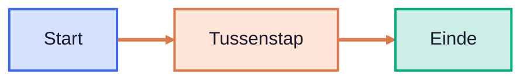

# Clidev - CEDA Slidev Presentaties

Skill voor het maken van Slidev presentaties in de CEDA/Npuls huisstijl. Bouwt voort op `/slidev` voor algemene Slidev-kennis en op `/vormgever-npuls-huisstijl` voor alle brand- en huisstijlbeslissingen. De regels hier hebben voorrang op beide.

**Verantwoordelijkheidsverdeling:**

- `clidev` (deze skill) — structuur: slide-patronen, positionering, grid-logica, componentassemblage, workflow
- `vormgever-npuls-huisstijl` — brand: kleurtokens, typografische schaal, toegestane kleurencombinaties
- `style.css` in de repo — integratiepunt: vertaalt brand-tokens naar CSS-variabelen die slides gebruiken

Wijzigingen in `vormgever-npuls-huisstijl` vereisen maximaal een update van `style.css`. Geen enkele slide-file en geen regel in deze skill mag daarvoor aangepast worden.

## Projectsetup (altijd als eerste stap)

Voer deze stappen uit in volgorde voordat je een presentatie aanmaakt.

### 1. Controleer of de slidev skill aanwezig is

```bash
ls ~/.claude/skills/slidev/ 2>/dev/null && echo "aanwezig" || echo "niet aanwezig"
```

Als de slidev skill niet aanwezig is, installeer hem eerst:

```bash
npx skills add slidevjs/slidev
```

### 2. Zoek het project op de machine

Zoek naar een directory die de kenmerken heeft van het clidev project:

```bash
find ~ -type f -name "_template.md" 2>/dev/null | xargs -I{} dirname {} | while read dir; do
  [ -f "$dir/style.css" ] && [ -d "$dir/public/npuls" ] && echo "$dir"
done | head -3
```

- Als een directory gevonden wordt: gebruik die locatie, ongeacht de naam van de map
- Als niets gevonden wordt: vraag de gebruiker waar het project gekloond mag worden

```bash
git clone https://github.com/cedanl/clidev-presentaties.git <door-gebruiker-opgegeven-pad>
```

Na navigeren altijd `npm install` draaien als `node_modules/` ontbreekt.

## Quickstart

```bash
cp _template.md YYMMDD_onderwerp.md
npx slidev YYMMDD_onderwerp.md --open
```

Naamconventie: `YYMMDD_onderwerp.md` — bijv. `260311_leeranalytics.md`

## Projectstructuur

```
clidev-presentaties/
├── YYMMDD_onderwerp.md
├── _template.md
├── style.css                        # Integratiepunt: CSS-variabelen op basis van brand-tokens
└── public/
    ├── npuls/
    │   ├── powerpoint_slides/        # Achtergronden (Slide1-19.PNG)
    │   ├── powerpoint_illustrations/ # SVG-iconen
    │   ├── npuls_logo.jpg
    │   └── Npuls_lettertype/
    ├── shots/                        # Screenshots voor in de slides
    ├── ceda_contributors/
    └── presentations/YYMMDD_onderwerp/
```

## Thema en designsysteem

Elke presentatie gebruikt `theme: default` in de frontmatter. De huisstijl komt uit `style.css` in de projectroot — Slidev laadt dat bestand automatisch voor elke presentatie.

`style.css` definieert alle waarden als `var(--np-*)` CSS-variabelen. **Geen enkele slide-file bevat een hardcoded hex-waarde.** Gebruik altijd een CSS-klasse of `var(--np-*)` variabele. Zo absorbeert `style.css` een huisstijlupdate volledig.

Voor de huidige waarden van kleuren, fonts en toegestane combinaties: lees `vormgever-npuls-huisstijl` (`references/design-tokens.json`). Dupliceer die waarden nooit hier.

## Achtergronden

Gebruik altijd de `.np-bg` class met `background-image`. Nooit `background:` in de frontmatter.

```html
<div class="np-bg" style="background-image: url(/npuls/powerpoint_slides/Slide3.PNG);"></div>
```

| Bestand | Gebruik | Layout / bijzonderheden |
|---------|---------|------------------------|
| `Slide1.PNG` | Titelslide | Gecentreerde tekst, Npuls logo links boven in background |
| `Slide2.PNG` | Agenda | Tekst RECHTS: `margin-left: 42%`, geometrische vormen links zijn background |
| `Slide3.PNG` | Standaard contentslide | `.fill` wrapper, oranje boog rechtsonder als decoratie |
| `Slide4.PNG` / `Slide5.PNG` | Variant contentslide | Idem Slide3, kleinere boogvariant; onderling uitwisselbaar |
| `Slide6.PNG` | Emphasis / citaatslide | Grotendeels oranje, met een lichtgrijze driehoek linksboven-tot-linksonder (~0-28% breed, punt bij ~28%) — **witte tekst verplicht**, gebruik Cooper Light (`var(--np-font-secondary)`), maar houd alle tekst rechts van ~32% breedte (bijv. `margin-left: 32%` i.p.v. volledig gecentreerd), anders valt witte tekst weg tegen de lichtgrijze driehoek |
| `Slide7.PNG` | Afbeelding links | Roze rechthoek links, exact gemeten op `left: 6.9%; top: 10.4%; width: 41.4%; height: 79.2%`. Content-tekst begint pas bij **`left: 50%`** — niet 40-42% — anders overlapt een gecenterde screenshot-kaart de tekst (zie voorbeeld onder de tabel) |
| `Slide8.PNG` | Afbeelding rechts | Roze rechthoek rechts, exact gemeten op `left: 53.7%; top: 10.4%; width: 41.1%; height: 79.2%` |
| `Slide9.PNG` | Vergelijking / 2-koloms | Blauw links 40% voor titel (witte tekst), grijs rechts 60% voor kaarten; gebruik CSS grid `40% 60%` |
| `Slide10.PNG` | Data / statistieken | Wit links voor content, decoratief kleurenpaneel rechts in background — beperk content-grid tot `max-width: 62%` |
| `Slide11.PNG` | Genummerd proces / lijst | Oranje golf links als decoratie (vult de volledige hoogte van de linker 38%), 4 horizontale balken rechts; **zet geen titel in de linkerkolom** — de golflijn loopt daar dwars doorheen en overlapt tekst. Plaats eyebrow/titel/subtitel bovenaan de rechterkolom (62%), boven de genummerde stap-kaarten, en laat de linkerkolom leeg als pure decoratie |
| `Slide12.PNG` | Visueel intermezzo | Decoratieve achtergrond met overlappende kleurvlakken; minimale tekst of geen tekst |
| `Slide13.PNG` | Hoofdstukdivider (geel) | **Donkere tekst verplicht** (`color: var(--np-ink)`) — geel achtergrond, witte tekst heeft te weinig contrast |
| `Slide14.PNG` / `Slide15.PNG` | Hoofdstukdividers (oranje / blauw) | **Witte tekst verplicht** (`color: var(--np-white, #fff)`) — oranje of blauw achtergrond |
| `Slide16.PNG` | Over ons / contact | Wit links, roze paneel rechts met Npuls-logo — grens exact gemeten op **50%** (niet 60%: dat is fout gebleken en zorgde voor tekst die over het roze paneel liep). Gebruik `grid-template-columns: 50% 50%` en laat content rechts eindigen ruim vóór 50% (padding-right &ge; 2rem) |
| `Slide17.PNG` | Afsluitslide | Kleurrijk mozaïek, geen tekst |

## Content centreren

**Content slides** — wikkel de inhoud in `.fill`:

```html
<div class="np-bg" style="background-image: url(/npuls/powerpoint_slides/Slide3.PNG);"></div>

<div class="fill">

# Slidetitel

<p class="np-subtitle">Ondertitel die de slide samenvat.</p>

content hier

</div>
```

**Hoofdstukdivider** (Slide13/14/15):

```html
<div class="np-bg" style="background-image: url(/npuls/powerpoint_slides/Slide14.PNG);"></div>

<div class="flex items-center justify-center h-full">
  <div style="text-align: center;">
    <p class="eyebrow" style="color: rgba(255,255,255,0.85);">Deel 1</p>
    <h1 style="color: var(--np-white, #fff); font-size: 3rem;">Hoofdstuktitel</h1>
  </div>
</div>
```

**Titelslide, agenda en afsluitslide** volgen de patronen uit `_template.md`.

## Componentbibliotheek

Combineer bestaande klassen; verzin geen losse inline-stijlen waar een klasse bestaat. Gebruik `var(--np-*)` als je toch een kleur inline nodig hebt, nooit een hex-waarde.

**Tekst-helpers**
- `.eyebrow` — klein oranje kapitaaltjeslabel boven een titel
- `.np-subtitle` — ondertitel direct onder de `#` titel
- `.muted` — gedempte (grijze) tekst

**Kaarten** — `.np-card` met accentrand:
```html
<div class="np-card accent-blue">
  <span class="np-badge blue">Label</span>
  <h3 style="margin-top: 0.5rem;">Kop</h3>
  <p class="muted" style="font-size: 0.84rem; margin: 0;">Tekst.</p>
</div>
```
Accenten: `accent-blue`, `accent-orange`, `accent-green`, `accent-yellow`, `accent-pink`.

**Grids** — `.np-grid-2`, `.np-grid-3`, `.np-grid-4`.

**Badges** — `.np-badge` met kleur `blue` / `orange` / `green` / `yellow` / `pink` / `ghost`.

**Pipeline / proces** — `.np-pipeline` met `.np-step` en `.np-arrow`.

**Bewijsstrip** — `.np-proof-strip` met `.np-proof-item` en `.np-proof-divider`.

**Bottomline** — `.np-bottomline`.

**Genummerde chips** — `.np-num`.

**Screenshotframe** — `.np-frame` of `` met `border-radius: 8px`.

**Screenshot centreren in Slide7/Slide8** — plaats het frame nooit met losgeschatte `left`/`top`/`width`; gebruik de exact gemeten zone uit de achtergrondtabel en centreer daarbinnen met flex, zodat het beeld zowel horizontaal als verticaal in het roze vlak staat:

```html
<div class="np-bg" style="background-image: url(/npuls/powerpoint_slides/Slide7.PNG);"></div>

<div style="position: absolute; left: 6.9%; top: 10.4%; width: 41.4%; height: 79.2%; display: flex; align-items: center; justify-content: center;">
  <div class="np-frame" style="max-width: 85%;">
    
  </div>
</div>
```
Gebruik voor Slide8 dezelfde zone-structuur met `left: 53.7%; width: 41.1%`. Zet de content-tekst pas bij `left: 50%` (Slide7) resp. eindig de content-kolom vóór `53.7%` (Slide8) — nooit op 40-42%, want de gecenterde kaart eindigt verder naar binnen dan de rechthoek zelf.

## Capaciteitslimieten per slidetype

Dit zijn harde grenzen. Overschrijd je ze, splits dan de slide of verklein de content — verklein het font pas als laatste redmiddel (minimum `0.8rem`).

| Slidetype | Maximale content |
|-----------|-----------------|
| Titelslide | 1 titel + 1 subtitel + 1 contextregel |
| Contentslide met bullets | 1 titel + 6 bullets van max 10 woorden elk |
| Kaartgrid (3 kaarten) | 1 titel per kaart + 2 regels tekst per kaart |
| Kaartgrid (2 kaarten) | 1 titel per kaart + 4 regels tekst per kaart |
| Hoofdstukdivider | 1 eyebrow + 1 titel |
| Pipeline (4 stappen) | 1 titel per stap + 1 regel toelichting |
| Citaat | max 35 woorden |
| Agenda | max 6 items |

## Mensleesbaar en bewerkbaar markdown

Het gegenereerde `.md` bestand moet leesbaar en aanpasbaar zijn voor een collega die Slidev niet kent. Houd je aan deze regels:

**Slide-scheidingstekens en commentaar**

Elke slide begint met een `---` scheidingsteken (of `---` frontmatter voor de eerste). Zet boven elke slide een HTML-commentaar met het type:

```markdown
<!-- Slide: Agenda -->
---
```

```markdown
<!-- Slide: Hoofdstuk 1 - Datakwaliteit -->
---
```

**Let op — de allereerste slide:** de sluitende `---` van de frontmatter is zelf al de scheiding voor slide 1. Zet daar **geen** extra `<!-- comment -->\n---` vóór de content, anders ontstaat een lege spookslide met alleen het commentaar erin (elke volgende PNG-export schuift dan één op). Voor de titelslide komt het commentaar direct na de frontmatter, zonder eigen `---`:

```markdown
---
theme: default
...
---

<!-- Slide: Titelslide -->
<div class="np-bg" style="background-image: url(/npuls/powerpoint_slides/Slide1.PNG);"></div>
...
```

**Structuur binnen een slide**

Houd de volgorde consistent en voorspelbaar:

1. Het HTML-commentaar met slidetype
2. Het `---` scheidingsteken
3. De `np-bg` div (één regel, altijd eerste HTML-element)
4. Een lege regel
5. De content-wrapper (`fill` of equivalent)
6. Inhoud als gewone markdown: `#` voor titel, `-` voor bullets, platte alinea's
7. Sluit de content-wrapper

Voorbeeld van een goed opgebouwde contentslide:

```markdown
<!-- Slide: Wat is leeranalytics? -->
---

<div class="np-bg" style="background-image: url(/npuls/powerpoint_slides/Slide3.PNG);"></div>

<div class="fill">

# Wat is leeranalytics?

<p class="np-subtitle">Data inzetten om het leerproces te begrijpen en te verbeteren.</p>

- Studeergedrag in beeld brengen
- Vroeg signaleren wie dreigt uit te vallen
- Docenten ondersteunen met concrete inzichten
- Beleid baseren op bewijs, niet op aannames

</div>
```

**Kaarten en componenten**

Zet HTML-componenten (kaarten, grids, pipelines) na de markdown-content, niet er tussendoor. Houd elke component op één logisch blok zonder geneste divs dieper dan twee niveaus tenzij strikt noodzakelijk. Gebruik lege regels tussen elementen om scannen makkelijk te maken.

**Wat niet te doen**

- Geen `<style>` blokken in slide-files
- Geen hardcoded hex-kleuren
- Geen `theme:` anders dan `default`
- Geen `<p>` tags om platte tekst die ook als markdown geschreven kan worden

## Controleer en herstel na genereren

Na het aanmaken of aanpassen van een presentatie voer je twee checks uit: eerst een structurele pass op de broncode, dan een visuele pass op geëxporteerde PNG-bestanden. Lever pas op als beide passes schoon zijn.

### Stap 1: Structurele check (altijd)

Loop door elke slide in het `.md` bestand:

1. **Achtergrond aanwezig?** — elke slide (behalve afsluitslide) heeft een `np-bg` div
2. **Content gewrapped?** — content-slides gebruiken `.fill`, dividers hun eigen wrapper
3. **Capaciteitslimiet?** — tel bullets, kaartregels en woorden; splits de slide als de limiet overschreden is
4. **Geen hardcoded kleuren?** — zoek op `#` gevolgd door 3 of 6 hex-tekens; vervang door `var(--np-*)`
5. **Tekstkleur op dividers?** — Slide14/15 (oranje/blauw): `color: var(--np-white, #fff)`. Slide13 (geel): `color: var(--np-ink)` — witte tekst op geel heeft onvoldoende contrast
6. **Mermaid schaal?** — elk mermaid-blok heeft `{scale: 0.5}` of lager
7. **Illustratienamen?** — controleer exacte bestandsnaam als je niet zeker bent

Herhaal totdat een volledige pass schoon is.

### Stap 2: Visuele check via PNG-export (als Playwright beschikbaar is)

Exporteer elke slide als PNG en lees de afbeeldingen om visueel te verifiëren:

```bash
# Controleer of playwright-chromium aanwezig is
ls node_modules/playwright-chromium 2>/dev/null && echo "aanwezig" || echo "niet aanwezig"
```

Als niet aanwezig: vraag de gebruiker het te installeren via PowerShell (niet Git Bash):

```powershell
cd C:\pad\naar\clidev-presentaties
npm i -D playwright-chromium
```

Als aanwezig: exporteer naar PNG en lees elke slide:

```bash
npx slidev export YYMMDD_onderwerp.md --format png --output ./exports/YYMMDD_onderwerp/
```

Lees daarna elke PNG met het Read-gereedschap en controleer visueel:

- **Overflow** — wordt tekst afgeknipt of valt content buiten de slide?
- **Wit op wit** — is tekst op een lichte achtergrond leesbaar?
- **Donker op donker** — zijn divider-slides goed leesbaar?
- **Kaartbalans** — zijn kaarten in een grid gelijkmatig gevuld?
- **Achtergrond zichtbaar** — komt de PNG-achtergrond correct door?
- **Illustraties** — laden SVG-illustraties op de juiste plek en grootte?

Herstel problemen in het `.md` bestand, exporteer opnieuw, en herhaal totdat een volledige visuele pass schoon is. Meld daarna aan de gebruiker wat er gecorrigeerd is.

### Stap 3: Skill zelf bijwerken bij een structurele fout

Onderscheid tijdens stap 1 en 2 twee soorten problemen:

- **Eenmalig** — deze presentatie gebruikt bijvoorbeeld te veel bullets, of een verkeerde illustratienaam. Fix alleen het `.md` bestand.
- **Structureel** — de oorzaak zit in een instructie of voorbeeld in dít SKILL.md-bestand, en zou bij élke presentatie terugkomen die de instructie letterlijk volgt (bijvoorbeeld: een achtergrondtabel-regel die een layout voorschrijft die botst met de decoratie op die achtergrond, een verouderd codevoorbeeld, of een kleurregel die niet meer klopt met `design-tokens.json`).

Bij een structureel probleem volstaat het niet om alleen de presentatie te repareren — de volgende gebruiker (of jijzelf in een volgende sessie) loopt er dan opnieuw tegenaan. Werk in dat geval de skill zelf bij:

1. Corrigeer de betreffende instructie of het voorbeeld in dit SKILL.md-bestand.
2. Zoek de bronrepo op de machine:
   ```bash
   find ~ -maxdepth 6 -type d -iname ".github" 2>/dev/null | while read -r dir; do
     git -C "$dir" remote -v 2>/dev/null | grep -q "cedanl/.github" && echo "$dir"
   done
   ```
   Gebruik dat pad — niet een geïnstalleerde/gesymlinkte kopie in `~/.claude/skills` of `~/.agents/skills`. Vind je niets, vraag de gebruiker naar het pad of om toestemming om de repo te klonen.
3. Commit de wijziging in die repo met een duidelijke `fix(clidev): ...` boodschap die het probleem en de oorzaak benoemt, en push naar `main` — zo krijgen andere gebruikers die de skill via `npx skills add cedanl/.github` ophalen de correctie automatisch mee bij hun volgende install/update.
4. Meld aan de gebruiker expliciet welke skill-regel gecorrigeerd is en dat de fix gepusht is, naast wat er in de presentatie zelf is aangepast.

Vraag bij twijfel of destructieve twijfel (bijv. geen duidelijke bronrepo, of ongecommitte wijzigingen in die repo) eerst bevestiging aan de gebruiker voordat je commit of pusht.

## Illustraties

Controleer exacte bestandsnaam — hoofdlettergevoelig:

```bash
ls public/npuls/powerpoint_illustrations/ | grep -i "zoekwoord"
```

```html

```

### Bibliotheek: geïllustreerde SVG's per thema

Elke slide met tekst-links en illustratie-rechts gebruikt `np-grid-2` met `align-items: center` en de `` in de rechtse kolom met `width: 180px` à `220px`.

| Bestand | Afmeting | Kleuren | Gebruik |
|---------|----------|---------|---------|
| `learninganalystics.svg` | 220×240px | blauw + roze + zwart | Leeranalytics, datadashboards, studiegedrag in beeld |
| `data.svg` | 129×160px | groen + geel + roze | Data-architectuur, databases, informatiestapels |
| `hersenen.svg` | 168×140px | lichtblauw blob + zwart | Neurowetenschap, leerprocessen, cognitie, denken |
| `brains.svg` | — | — | Leerstrategieën, evidence-based onderwijs (alias van hersenen-variant) |
| `hat.svg` | 160×144px | geel + blauw + roze | Afstuderen, kwalificaties, opleidingsniveau, mijlpalen |
| `hands.svg` | 160×126px | geel + zwart + roze | Samenwerking, ondersteuning, community, partnerschap |
| `Slot.svg` | 720×720px | geel + zwart | Privacy, dataveiligheid, toegangsbeheer, AVG/GDPR |

Kies een illustratie waarvan de kleuren de huisstijlkleuren van de achtergrond aanvullen, niet herhalen. Op Slide3 (wit/licht) werken alle illustraties. Op Slide9 (blauw links) gebruik bij voorkeur een illustratie met geel of groen als dominante kleur.

## Kleurregels

Lees altijd `vormgever-npuls-huisstijl/references/design-tokens.json` voor je genereert om de actuele `allowed_combinations` te controleren.

**Minimumregel:** elk deck moet minstens **3 primaire Npuls-kleuren** zichtbaar hebben over alle slides. Primaire kleuren: oranje (`var(--np-orange)`), blauw (`var(--np-blue)`), roze (`var(--np-pink)`), geel (`var(--np-yellow)`), groen (`var(--np-green)`), zwart (`var(--np-ink)`).

**Toegestane combinaties** (achtergrond → tekst/accenten):
- blauw achtergrond → geel, roze
- roze achtergrond → blauw, groen, zwart, oranje
- geel achtergrond → oranje, zwart, blauw
- groen achtergrond → roze, zwart
- oranje achtergrond → zwart, roze (= Slide6)

Na het genereren: tel de primaire kleuren die over het deck aanwezig zijn. Voeg een badge, kaartaccent of illustratie toe als het minimum niet gehaald is.

### Stap 0 bij genereren: lees design-tokens

```bash
cat ~/.claude/skills/vormgever-npuls-huisstijl/references/design-tokens.json
```

Controleer of de `allowed_combinations` ongewijzigd zijn. Werk verder met de waarden uit dat bestand, nooit vanuit geheugen.

## Technische vereisten

- **Theme**: `theme: default`, nooit `theme: ./theme`
- **Achtergronden**: altijd `<div class="np-bg" style="background-image: ...">`, nooit `background:` in de frontmatter
- **Kleuren**: altijd `var(--np-*)`, nooit een losse hex-waarde
- **Content**: wikkel in `.fill` (of een van de titel/divider-patronen)
- **Hoofdstukslides** Slide14/15 (oranje/blauw): `color: var(--np-white, #fff)` op titels. Slide13 (geel): `color: var(--np-ink)` — witte tekst op geel heeft onvoldoende contrast
- **Afsluitslide** (Slide17): geen tekst, alleen achtergrond
- **Agenda slide** (Slide2): content rechts plaatsen, niet links
- **Bulletlijsten in HTML-blokken**: gebruik **nooit** markdown `- item` syntax binnen een `<div>`. Gebruik in plaats daarvan altijd expliciete `<ul><li>item</li></ul>` HTML. Markdown bullets worden door Vue omgezet naar `<li>` elementen zonder sluitende tag, wat de dev-server breekt
- **Code highlighting**: `{1|2-3|all}` syntax niet in een `v-click` wrapper
- **Overflow**: splits slide als content niet past; verklein font pas als laatste redmiddel (min `0.8rem`)

### Mermaid

Er is precies **één standaard** voor mermaid-diagrammen. Gebruik altijd dit patroon, ook voor een simpel 2-node-diagram — verzin geen eigen variant:

1. **Centreren** — een los mermaid-blok rendert linksuitgelijnd. Wrap het altijd in een flex-container, met een lege regel aan weerszijden van het codeblok (nodig om de markdown binnen de div te laten parsen).
2. **Kleur en dikte** — de standaard mermaid-rendering is dunne grijze lijnen die nauwelijks zichtbaar zijn, zeker met `scale: 0.5`. Geef elke node een `classDef` met een lichte paletkleur als vulling en de bijbehorende primaire kleur als rand (zelfde principe als `.np-card.accent-*`), en zet de verbindingslijnen dikker en in een paletkleur via `linkStyle`.
3. **Geen custom `fontFamily`** in `%%{init: ...}%%` — dat verstoort mermaid's eigen breedteberekening voor de nodes, waardoor labeltekst afgekapt wordt door de node-rand. Laat het lettertype op de mermaid-default staan.

```markdown
<div style="display: flex; justify-content: center; margin-top: 1rem;">


```mermaid {scale: 0.5}
%%{init: {'theme': 'base'}}%%
graph LR
    A[Start]:::blue --> B[Tussenstap]:::orange
    B --> C[Einde]:::green

    classDef blue fill:#D6E2FD,stroke:#3D68EC,stroke-width:2px,color:#1A1A2E;
    classDef orange fill:#FFE4D8,stroke:#DD784B,stroke-width:2px,color:#1A1A2E;
    classDef green fill:#CCEEE6,stroke:#00AF81,stroke-width:2px,color:#1A1A2E;
    linkStyle default stroke:#DD784B,stroke-width:3px;
```

</div>
```

Houd scale op `0.5` als default. Labels max 25 tekens. De drie `classDef`-kleuren (blue/orange/green) zijn het standaardpalet; voeg `yellow` (`fill:#FCF5D4,stroke:#F4D74B,color:#1A1A2E`) of `pink` (`fill:#FAEAEA,stroke:#F4D9DC,color:#1A1A2E`) toe als een diagram meer dan drie categorieën nodes heeft.

## CLI

```bash
npx slidev YYMMDD_onderwerp.md --open     # Dev server (localhost:3030)
npx slidev export YYMMDD_onderwerp.md    # PDF
npx slidev export YYMMDD_onderwerp.md --format pptx
```

Druk op `P` in de browser voor presentatormodus.

## Vaste CEDA-slide (intro) en vaste afsluitslide (links)

Elke presentatie die met deze skill wordt gemaakt bevat **twee** vaste, woordelijk identieke slides: een introslide die uitlegt wie CEDA is, en een afsluitslide met de CEDA-links. Bewust gesplitst — de introslide bevat geen links, de afsluitslide wel, zodat de links op het scherm staan op het moment dat het publiek vragen stelt.

**Introslide — "Wie is CEDA"**
- **Locatie:** vroeg — direct na de agenda (slide 3), vóór de eerste hoofdstukdivider. Niet aan het einde: de luisteraar weet dan al wie CEDA is voordat de inhoud begint.
- **Inhoud:** titel, subtitel en drie bullets over wat CEDA doet. **Geen links** — die horen alleen op de afsluitslide, niet dubbel.
- **Achtergrond:** `Slide16.PNG`, structuur 50/50-grid, roze paneel met Npuls-logo rechts.

**Afsluitslide — "Blijf in contact"**
- **Locatie:** altijd de allerlaatste slide van het deck.
- **Inhoud:** titel, korte uitnodigingstekst, en drie kaarten (GitHub / Community / Email) met de CEDA-links.
- **Achtergrond:** `Slide1.PNG` — bewust dezelfde achtergrond als de titelslide (bookend-effect); dit is géén fout, niet vervangen door `Slide17.PNG`. `Slide17.PNG` (het kleurrijke mozaïek) is ongeschikt als afsluitslide met tekst omdat de veelkleurige achtergrond leesbaarheid in de weg zit.

**Voor beide geldt:**
- **Bron:** beide slides staan al kant-en-klaar in `_template.md` (secties "VASTE CEDA-SLIDE" en "VASTE AFSLUITSLIDE"). Kopieer ze woordelijk mee wanneer je `_template.md` gebruikt als basis voor een nieuwe presentatie — verzin geen eigen versie en parafraseer de tekst niet.
- **Niet aanpassen:** titel, tekst, bullets/kaarten blijven exact zoals in `_template.md`.
- **Als een presentatie niet uit `_template.md` is gestart** (bijvoorbeeld een oudere presentatie die je aanpast): haal beide slides alsnog woordelijk over uit `_template.md` en voeg ze toe op de juiste plek, in plaats van er zelf een te schrijven.
- **Uitzondering:** alleen weglaten als de gebruiker dat expliciet vraagt voor een specifieke presentatie.

## Afsluiting na aanmaken presentatie

Na het aanmaken sluit je altijd af met een korte instructie. Vermeld de exacte bestandsnaam en het pad:

```
Om de presentatie te bekijken, run vanuit <projectpad>:

    npx slidev <bestandsnaam>.md --open

De presentatie opent op http://localhost:3030
```

## Installatie

```bash
npx skills add cedanl/.github   # levert clidev en vormgever-npuls-huisstijl
npx skills add slidevjs/slidev  # basiskennis Slidev
```

De presentaties en het designsysteem (`style.css`, `_template.md`, achtergronden) staan in `cedanl/clidev-presentaties`.
